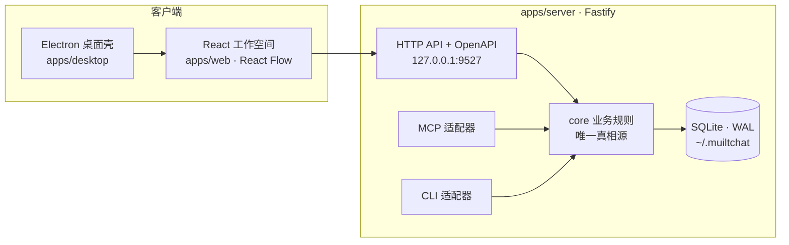

<div align="center">
  
</div>

<div align="center">
  <h1>Conflux</h1>
  <p><b>让每一个 AI 编程会话，汇入同一个工作空间。</b></p>
  <p>本地优先的桌面工作空间 · 连接 AI 编程会话、智能体、消息与共享上下文</p>
  <p>简体中文 ｜ <a href="./docs/README.en.md">English</a></p>
  <p>
    
    
    
    <a href="./LICENSE"></a>
  </p>
</div>

---

AI 编程助手通常以彼此隔离的进程运行，于是这些简单的问题变得难以回答：

- 另一个会话正在做什么？
- 之前的会话把实现记录发布在哪里？
- 两个智能体如何在不手动复制粘贴的情况下交换工作结果？
- 哪些运行时智能体仍然在线？

**Conflux 把这些会话连成一张图**：发布知识、跨会话提问、异步收回复、离线自动唤醒——不依赖任何外部数据库、消息代理或托管控制平面，数据默认就在本机 SQLite 里。

公开项目名、CLI 入口和 npm package 名称均为 `Conflux`（`conflux` / `@conflux/shared`）。旧 CLI 入口 `muiltchat`、环境变量和默认数据目录继续保留兼容性。

## ✨ 核心特性

|      | 能力             | 说明                                                                 |
| ---- | ---------------- | -------------------------------------------------------------------- |
| 🕸️   | **会话图谱**     | 以图谱方式浏览会话、智能体和有向对话通道，节点即会话，连线即对话        |
| 📚   | **共享上下文**   | 发布可搜索的笔记，查询其他会话拥有的上下文                              |
| ✉️   | **异步消息**     | 向其他会话提问并异步接收回复，支持 `/resume` 之后的会话继承              |
| 🤖   | **内置智能体**   | 定义带有系统提示词的模型智能体，在工作空间中直接对话                     |
| 🛠️   | **运行时智能体** | 配置 Claude Code / Codex CLI 预设，在独立终端环境中启动                  |
| 🔌   | **Claude 集成**  | 通过 MCP 与可选的生命周期 Hooks 接入 Claude Code 会话                   |
| 🔀   | **多接口同核**   | MCP、HTTP REST、CLI 三接口调用同一套 core，行为完全一致                  |
| 💾   | **本地优先**     | SQLite（WAL 模式）保存全部状态，零外部服务依赖                           |
| 🖥️   | **桌面客户端**   | Electron 窗口运行 React 工作空间，自动管理本地服务生命周期               |

## 🚀 快速开始

**环境要求**：Node.js 22 LTS（server 包仍声明 ≥18 兼容）· npm ≥ 9 · 需要 MCP 会话集成时装 Claude Code · 需要内置智能体时准备 Anthropic/OpenAI API key。

```bash
git clone https://github.com/yudongyouqing/Conflux.git
cd Conflux
npm ci

# 启动桌面客户端（自动拉起 API 服务器 + Vite，就绪后打开 Electron 窗口）
npm run dev:desktop
```

开发环境端点：

| 端点         | 地址                          |
| ------------ | ----------------------------- |
| 工作空间     | <http://127.0.0.1:5173>       |
| API 服务器   | <http://127.0.0.1:9527>       |
| OpenAPI 文档 | <http://127.0.0.1:9527/docs>  |

> ⚠️ 不要同时运行 `npm run dev:all` 和 `npm run dev:desktop`——两者使用相同端口与 SQLite 数据目录。只想用浏览器开发时，跑 `npm run dev:web-stack`。

生产模式（构建后由本地服务器托管前端）：

```bash
npm start   # → http://127.0.0.1:9527
```

遇到启动、端口、数据库、MCP 或迁移问题，请查看[故障排查指南](docs/TROUBLESHOOTING.md)。

## 🧭 架构



开发模式下 Electron 主进程负责启动 API 与 Vite 服务，健康检查通过后加载桌面窗口。核心业务逻辑收敛在 `apps/server/src/core`，HTTP、MCP、CLI 三个适配层调用同一套核心操作，保证跨接口的数据行为一致。共享 TypeScript 类型位于 `packages/shared`。

```text
apps/
  desktop/       Electron 主进程和桌面开发运行时
  server/        Fastify API、SQLite 核心、MCP 服务器和 CLI
  web/           使用 Vite 和 React Flow 构建的 React 工作空间
packages/
  shared/        server 和 web 共用的 TypeScript 类型
docs/
  README.en.md   English README
  superpowers/   开发计划和设计规格
```

## 💬 跨会话对话

Web 工作空间可以直接发起和观察 AI 会话之间的对话，不必回到 CLI：

- **@ 提及**：消息流页顶部输入 `@`（半角/全角均可）弹出活跃会话选择器，选中后回车发送；发送必须且只能 @ 一个目标，再次输入 `@` 会替换当前目标。
- **发起对话通道**：会话详情抽屉中的通道输入框默认以当前会话为发起方——即"让会话 A 去问会话 B"（`/web/ask` 可选 `from_session`）。回复进入 B 的收件箱，B 的下一次运转即可看到。
- **通道视图**：图谱连线或消息卡片可打开对话通道，气泡展示问答往来，5 秒轮询刷新。

### 状态徽标与自动应答

会话状态点有三种：<span>🟢 在线</span> · <span>🟠 正在回复中（busy）</span> · <span>⚪ 离线</span>。busy 由 Claude 的 prompt/Stop 事件对与 Codex 的 rollout 写入新鲜度推导。

向离线或空闲会话提问时，服务端自动无头唤醒对方处理收件箱（可关闭）：

| 目标状态   | 行为                                                                                              |
| ---------- | ------------------------------------------------------------------------------------------------- |
| 正在回复中 | 不打扰，本轮结束后自然看到收件箱                                                                  |
| 在线但空闲 | 全新无头运行并以该会话身份作答；Claude 优先 resume 真实对话，Codex 受线程写锁限制采用会话摘要注入 |
| 离线       | 无头 resume 真实对话——完整上下文，回复写入真实会话历史（CLI 可见）                                |

总开关：`auto_wake`（设置页 / `PUT /settings/terminal`）；同会话 90 秒去重。唤醒回复经 `reply_ask` 送达，线程中可见。

## 🔌 接入 Claude Code

### MCP

在 Claude Code 项目所用的 `.mcp.json` 中添加：

```json
{
  "mcpServers": {
    "conflux": {
      "command": "npx",
      "args": ["tsx", "<repo>/apps/server/src/index.ts", "mcp"]
    }
  }
}
```

> 同一配置只保留一个 server key（新配置用 `conflux`，旧项目可继续用 `muiltchat`）；保留两个会启动两份 server。修改 `.mcp.json` 后必须**完全重启 MCP 宿主**，刷新网页不会重建 stdio 连接。

MCP 会话可用的工具：`publish_context` · `query_context` · `ask_session` · `reply_ask` · `check_inbox` · `check_replies` · `get_graph`。每个会话都会注册到图谱中，并可以参与共享上下文和异步消息。

### Hooks

```bash
npx tsx apps/server/src/index.ts hooks install     # 安装（自动备份 settings.json）
npx tsx apps/server/src/index.ts hooks uninstall   # 卸载
```

Hooks 把会话生命周期事件与身份关联起来并持续更新在线状态，支持 `SessionStart`、`UserPromptSubmit`、`Stop` 三类事件；同时维护自定义标题、`/resume` 会话继承和未投递消息。Claude Code 使用自定义配置目录时，通过 `CLAUDE_CONFIG_DIR` 指定。安装时会自动补录当时已在运行的 Claude Code 会话（也可单独执行 `hooks backfill`）；Codex 会话暂不支持补录。

### Codex CLI

Codex 不读取 Claude 的 `.mcp.json`，项目级挂载写在本仓库根目录的 `.codex/config.toml`（仅 trusted 项目生效）：

```toml
[mcp_servers.conflux]
command = "cmd"
args = ["/c", "npx", "tsx", "apps/server/src/index.ts", "mcp"]
startup_timeout_sec = 60
```

非 Windows 平台改用 `command = "npx"`、`args = ["tsx", "apps/server/src/index.ts", "mcp"]`。首次在新目录启动需批准项目信任；改完配置必须完全退出并重启 Codex 宿主。

<details>
<summary><b>Codex 会话标题是如何来的（无 Hooks 机制）</b></summary>

服务端每 30 秒随 MCP 心跳和进程存活探测扫描 `~/.codex/sessions` 下的 rollout 记录与 `~/.codex/session_index.jsonl`：优先采用 Codex 自己维护的 thread_name，没有时回退到首条用户指令摘要。会话发出首条指令后约 30 秒内获得标题；通过 `register_session` 或界面手动命名的会话不会被自动覆盖。

</details>

## 🤖 智能体

**内置智能体**是保存在本地数据库中的模型智能体：在 Agents 标签页配置名称、系统提示词、提供商和模型，然后直接在工作空间中对话。需要环境变量 `ANTHROPIC_API_KEY` / `OPENAI_API_KEY`；`GET /settings` 会报告哪些提供商已完成配置。

**运行时智能体**是启动真实 CLI 编程助手的预设，可配置：运行时（Claude Code / Codex）、工作目录、模型、API base URL 与 key、额外环境变量、启动指令、心跳与定时运行间隔。桌面工作空间可在新终端窗口启动它们；定时预设也能在后台以无头模式运行。启动器会清理会话范围的环境变量，并在首选终端不可用时使用平台相关的后备方案。

> 🔐 只在本地安全配置中使用真实 API key，不要提交到 Git、日志或导出文件；提交前可跑 `npm run check:secrets` 扫描。

## 💾 数据与配置

默认数据目录 `~/.muiltchat`（兼容重命名前版本，**升级不会自动迁移**）。目录优先级：CLI `--data-dir` → `CONFLUX_HOME` → `MUILTCHAT_HOME` → 已有项目目录 → `~/.muiltchat`。数据库文件 `data.db`，启用 SQLite WAL 模式。不需要部署任何外部数据库服务。

```bash
# 自定义数据目录
CONFLUX_HOME=/path/to/data npm run dev:server        # Linux/macOS/Git Bash
$env:CONFLUX_HOME = "C:\path\to\data"                 # Windows PowerShell

# 显式迁移旧目录（只复制数据库文件，保留源目录，带迁移标记）
npx tsx apps/server/src/index.ts migrate --from <legacy-dir> --to <conflux-dir>
npx tsx apps/server/src/index.ts migrate --status --to <conflux-dir>

# 备份 / 恢复（导入先校验，单事务写入，失败整体回滚）
npx tsx apps/server/src/index.ts data export --output ./conflux-backup.json
npx tsx apps/server/src/index.ts data import --file <bundle.json> --conflict skip|overwrite|copy
```

<details>
<summary><b>更多路径与作用域细节</b></summary>

- CLI 支持 `--scope global` 与 `--scope project`（自动探测 `CLAUDE_PROJECT_DIR`）。
- 精确查看生效路径：`npx tsx apps/server/src/index.ts --data-dir /path/to/data path`
- Windows 数据目录为 `%USERPROFILE%\.muiltchat`；卸载 Conflux 不会删除用户数据。
- 旧变量 `MUILTCHAT_HOME` / `MUILTCHAT_HOST` / `MUILTCHAT_PORT` 与新变量 `CONFLUX_HOME` / `CONFLUX_HOST` / `CONFLUX_PORT` 同时生效，新变量优先。

</details>

## 📦 发布与安装包

GitHub Actions 在 `v*` 标签上构建 Windows 发布，包含**未签名**的 NSIS 安装包与 `win-unpacked` 目录包——安装包不代表代码已签名，请验证来源后使用。

```bash
npm run package:desktop:dir   # 当前平台目录包
npm run package:desktop       # Windows NSIS 安装包
```

产物输出到 `release/`（不入 Git）。Windows 上 native `better-sqlite3` 可能需要 Visual Studio C++ Build Tools；本机没有该工具链时请使用仓库的 Windows CI。

## 🗺 路线图

- ✅ Electron 桌面壳、服务生命周期、端口诊断与窗口安全边界
- ✅ React + Vite + React Flow 工作空间、Fastify API、MCP + Hooks
- ✅ Claude Code / Codex 存活探测、恢复继承、异步协作消息、自动唤醒
- ✅ 版本化数据导入导出、旧目录迁移、稳定错误码与敏感信息扫描
- ✅ 内部标识更名 Conflux，兼容层保留（CLI 双入口、env 双变量）
- 🚧 自动更新与代码签名
- 🚧 macOS / Linux 正式安装包发行

## ⌨️ 开发命令

```bash
npm run build            # 构建 shared → server → web 全量
npm run dev:desktop      # Electron 桌面开发模式（唯一推荐入口）
npm run dev:all          # 同 dev:desktop（别名）
npm run dev:web-stack    # 纯浏览器开发栈（server + Vite 并行）
npm run dev:server       # 只起 server
npm run dev:web          # 只起 web
npm run mcp              # stdio MCP server
npm test -w apps/server  # server 回归测试
npm run ci:test          # CI 等价测试 + 发布配置检查
npm run ci:build         # CI 等价构建
npm run check:secrets    # 敏感信息扫描
node --test apps/desktop/test/dev-services.test.cjs apps/desktop/test/runtime-config.test.cjs
```

## 📡 HTTP API

本地服务器默认绑定 `127.0.0.1:9527`，OpenAPI 文档与 Swagger UI 在 [`/docs`](http://127.0.0.1:9527/docs)。

常用资源：`/healthz` · `/graph` · `/sessions` · `/messages` · `/context` · `/agents` · `/conversations` · `/runtimes` · `/settings` · `/audit` · `/data/export` · `/data/import`

需要会话身份的请求带 `X-Session-Id` 请求头；HTTP、MCP、CLI 共享同一套核心数据操作。启动失败、端口冲突、数据库锁定等问题见[故障排查](docs/TROUBLESHOOTING.md)。

## 🤝 贡献

欢迎 Issue、改进建议和 PR。提交前请阅读[贡献指南](CONTRIBUTING.md)，并保持：改动聚焦、说明用户可见行为变化、`npm run build`、`npm test -w apps/server` 通过、桌面相关改动跑 `npm run test:desktop`、`npm run check:secrets` 与 `git diff --check` 干净。

## 📚 文档

| 文档                                   | 内容                       |
| -------------------------------------- | -------------------------- |
| [迁移指南](docs/MIGRATION.md)           | 新旧命名/目录兼容与迁移步骤 |
| [故障排查](docs/TROUBLESHOOTING.md)     | 端口、数据库、MCP、数据恢复 |
| [贡献指南](CONTRIBUTING.md)             | 开发规范与 PR 流程          |
| [更新日志](CHANGELOG.md)                | 版本历史                    |
| [English README](docs/README.en.md)     | English documentation       |

---

<div align="center">

Conflux 使用 [MIT License](./LICENSE) 发布

**本地优先 · 会话汇流 · 零外部依赖**

</div>
