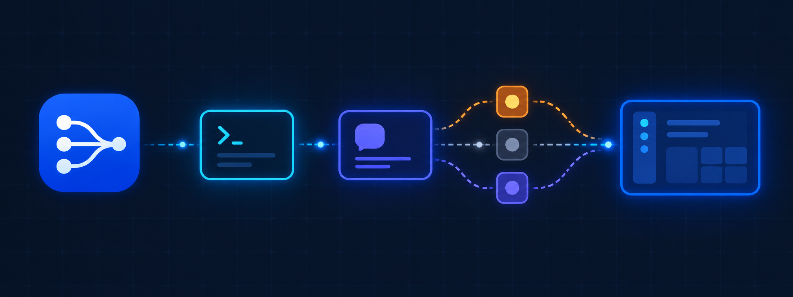
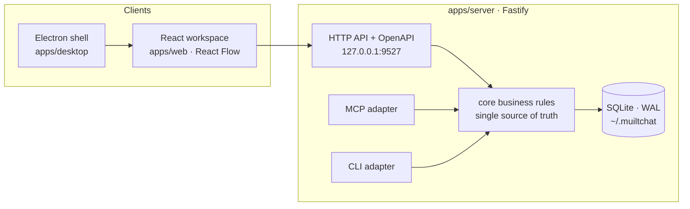

<div align="center">
  
</div>

<div align="center">
  <h1>Conflux</h1>
  <p><b>Every AI coding session, flowing into one workspace.</b></p>
  <p>A local-first desktop workspace for connecting AI coding sessions, agents, messages, and shared context</p>
  <p><a href="../README.md">简体中文</a> ｜ English</p>
  <p>
    
    
    
    <a href="../LICENSE"></a>
  </p>
</div>

---

AI coding assistants usually run as isolated processes, which makes simple questions hard to answer:

- What is another session working on?
- Where did a previous session publish the implementation notes I need?
- How can two agents exchange work without manual copy and paste?
- Which runtime agents are still online?

**Conflux connects those sessions into a graph**: publish knowledge, ask across sessions, receive replies asynchronously, auto-wake offline peers — with no external database, message broker, or hosted control plane. Data stays in a local SQLite database by default.

The public project name, CLI entry, and npm package names are all `Conflux` (`conflux` / `@conflux/shared`). The legacy `muiltchat` CLI entry, environment variables, and default data directory remain supported for compatibility.

## ✨ Features

|      | Capability              | Description                                                                        |
| ---- | ----------------------- | ---------------------------------------------------------------------------------- |
| 🕸️   | **Session graph**       | Browse sessions, agents, and directed conversation channels as a live graph         |
| 📚   | **Shared context**      | Publish searchable notes and query context owned by other sessions                  |
| ✉️   | **Async messaging**     | Ask another session a question and receive the reply later, across `/resume` too    |
| 🤖   | **Internal agents**     | Define model-backed agents with a system prompt and chat from the workspace         |
| 🛠️   | **Runtime agents**      | Configure Claude Code / Codex CLI presets and launch them in clean terminals        |
| 🔌   | **Claude integration**  | Connect Claude Code sessions through MCP and optional lifecycle hooks               |
| 🔀   | **One core, many UIs**  | MCP, HTTP REST, and the CLI all call the same core for consistent behavior          |
| 💾   | **Local-first storage** | All state in SQLite with WAL mode; zero external service dependencies               |
| 🖥️   | **Desktop client**      | Run the React workspace in an Electron window with managed local services           |

## 🚀 Quick Start

**Requirements**: Node.js 22 LTS (the server package still declares ≥18 compatibility) · npm ≥ 9 · Claude Code for MCP session integration · an Anthropic/OpenAI API key for internal agents.

```bash
git clone https://github.com/yudongyouqing/Conflux.git
cd Conflux
npm ci

# Start the desktop client (launches the API server + Vite, opens Electron when ready)
npm run dev:desktop
```

Development endpoints:

| Endpoint         | URL                           |
| ---------------- | ----------------------------- |
| Workspace        | <http://127.0.0.1:5173>       |
| API server       | <http://127.0.0.1:9527>       |
| OpenAPI docs     | <http://127.0.0.1:9527/docs>  |

> ⚠️ Do not run `npm run dev:all` and `npm run dev:desktop` at the same time — both use the same ports and SQLite data directory. For a browser-only dev stack run `npm run dev:web-stack`.

Production mode (builds everything, then serves the frontend locally):

```bash
npm start   # → http://127.0.0.1:9527
```

For startup, port, database, MCP, or migration issues, see the [troubleshooting guide](TROUBLESHOOTING.md).

## 🧭 Architecture



In development mode the Electron main process starts the API and Vite services and loads the desktop window once health checks pass. Core business logic lives in `apps/server/src/core`; the HTTP, MCP, and CLI adapters call the same core operations, keeping data behavior consistent across interfaces. Shared TypeScript types live in `packages/shared`.

```text
apps/
  desktop/       Electron main process and desktop development runtime
  server/        Fastify API, SQLite core, MCP server, and CLI
  web/           React workspace built with Vite and React Flow
packages/
  shared/        Shared TypeScript types for the server and web apps
docs/
  README.en.md   English README
  superpowers/   Development plans and design specifications
```

## 💬 Cross-session Conversations

The web workspace can start and observe conversations between AI sessions without dropping back to the CLI:

- **@ mentions**: type `@` at the top of the message stream to pick an active session, then press Enter. Exactly one target per message; typing `@` again replaces the target.
- **Conversation channels**: the channel box in a session's detail drawer uses that session as the asker by default — "let session A ask session B" (`/web/ask` accepts an optional `from_session`). The reply lands in B's inbox for its next run.
- **Channel view**: open a graph edge or message card to see the Q&A exchange in bubbles, refreshed every 5 seconds.

### Status badges and auto-wake

Session status dots: 🟢 online · 🟠 replying (busy) · ⚪ offline. Busy is derived from Claude's prompt/Stop event pairs and Codex's rollout write freshness.

Asking a question of an offline or idle session triggers a headless wake so the peer can process its inbox (optional):

| Target state | Behavior                                                                                     |
| ------------ | --------------------------------------------------------------------------------------------- |
| Busy         | Left alone; the inbox is surfaced naturally after the current turn                            |
| Idle         | A fresh headless run answers as that session; Claude prefers resuming the real conversation, Codex falls back to digest injection due to its thread write lock |
| Offline      | Headless resume of the real conversation — full context, reply written into real history (visible in the CLI) |

Master switch: `auto_wake` (settings page / `PUT /settings/terminal`); 90-second per-session dedup. Wake replies arrive via `reply_ask` and stay visible in the thread.

## 🔌 Claude Code Integration

### MCP

Add Conflux to the `.mcp.json` used by a Claude Code project:

```json
{
  "mcpServers": {
    "conflux": {
      "command": "npx",
      "args": ["tsx", "<repo>/apps/server/src/index.ts", "mcp"]
    }
  }
}
```

> Keep exactly one server key per configuration (`conflux` for new setups; legacy projects may keep `muiltchat`) — two keys start two servers. After changing `.mcp.json`, **fully restart the MCP host**; reloading the web page does not recreate the stdio connection.

Tools available to MCP sessions: `publish_context` · `query_context` · `ask_session` · `reply_ask` · `check_inbox` · `check_replies` · `get_graph`. Each session registers itself in the graph and can participate in shared context and async messaging.

### Hooks

```bash
npx tsx apps/server/src/index.ts hooks install     # install (backs up settings.json)
npx tsx apps/server/src/index.ts hooks uninstall   # remove
```

Hooks associate lifecycle events with session identity and keep liveness current, supporting `SessionStart`, `UserPromptSubmit`, and `Stop`; they also maintain custom titles, `/resume` lineage, and undelivered messages. Set `CLAUDE_CONFIG_DIR` when Claude Code uses a custom configuration directory. Installing also backfills Claude Code sessions that were already running at that moment (or run `hooks backfill` standalone); Codex backfill is not supported yet.

### Codex CLI

Codex does not read Claude's `.mcp.json`. Its project-scope mount lives in the repo-root `.codex/config.toml` (honored for trusted projects only):

```toml
[mcp_servers.conflux]
command = "cmd"
args = ["/c", "npx", "tsx", "apps/server/src/index.ts", "mcp"]
startup_timeout_sec = 60
```

On non-Windows platforms use `command = "npx"` with `args = ["tsx", "apps/server/src/index.ts", "mcp"]`. Approve project trust on first launch in a new directory; fully restart the Codex host after changing the file.

<details>
<summary><b>How Codex session titles work (no hooks available)</b></summary>

Every 30 seconds, alongside the MCP heartbeat and liveness probe, the server scans the rollout records under `~/.codex/sessions` plus `~/.codex/session_index.jsonl`: it prefers the thread title Codex maintains itself and falls back to an excerpt of the first user instruction. A session gains its title within about 30 seconds of its first instruction; sessions named via `register_session` or the UI are never overridden.

</details>

## 🤖 Agents

**Internal agents** are model-backed agents stored in the local database: configure a name, system prompt, provider, and model from the Agents tab, then chat directly. They require `ANTHROPIC_API_KEY` / `OPENAI_API_KEY`; `GET /settings` reports which providers are configured.

**Runtime agents** are presets for launching real CLI coding assistants: runtime (Claude Code / Codex), working directory, model, API base URL and key, extra environment variables, startup instructions, heartbeat and scheduled-run intervals. The workspace can launch them in a new terminal window; scheduled presets can also run headlessly in the background. The launcher removes session-scoped environment variables and falls back through platform-specific terminal chains when the preferred one is unavailable.

> 🔐 Keep real API keys in local secure configuration only — never in Git, logs, or export files. Run `npm run check:secrets` before sharing changes.

## 💾 Data and Configuration

The default data directory is `~/.muiltchat` (kept for pre-rename compatibility; **upgrades never migrate automatically**). Directory precedence: CLI `--data-dir` → `CONFLUX_HOME` → `MUILTCHAT_HOME` → existing project directory → `~/.muiltchat`. The database file is `data.db` with SQLite WAL mode enabled. No external database service is required.

```bash
# Custom data directory
CONFLUX_HOME=/path/to/data npm run dev:server        # Linux/macOS/Git Bash
$env:CONFLUX_HOME = "C:\path\to\data"                 # Windows PowerShell

# Explicit legacy migration (copies database files only, preserves the source, writes a marker)
npx tsx apps/server/src/index.ts migrate --from <legacy-dir> --to <conflux-dir>
npx tsx apps/server/src/index.ts migrate --status --to <conflux-dir>

# Backup / restore (imports are validated, then written in one transaction — all or nothing)
npx tsx apps/server/src/index.ts data export --output ./conflux-backup.json
npx tsx apps/server/src/index.ts data import --file <bundle.json> --conflict skip|overwrite|copy
```

<details>
<summary><b>More paths and scope details</b></summary>

- The CLI supports `--scope global` and `--scope project` (auto-detected via `CLAUDE_PROJECT_DIR`).
- Print the effective path: `npx tsx apps/server/src/index.ts --data-dir /path/to/data path`
- On Windows the data directory is `%USERPROFILE%\.muiltchat`; uninstalling Conflux does not delete user data.
- Legacy `MUILTCHAT_HOME` / `MUILTCHAT_HOST` / `MUILTCHAT_PORT` and new `CONFLUX_HOME` / `CONFLUX_HOST` / `CONFLUX_PORT` all work; the new variables take precedence.

</details>

## 📦 Releases and Installers

GitHub Actions builds Windows releases from `v*` tags, producing an **unsigned** NSIS installer and a `win-unpacked` directory artifact — unsigned artifacts are not code-signed; verify the source before running them.

```bash
npm run package:desktop:dir   # unpacked directory for the current platform
npm run package:desktop       # Windows NSIS installer
```

Artifacts are written to `release/` (ignored by Git). Native `better-sqlite3` packaging on Windows may require Visual Studio C++ Build Tools; use the repository Windows CI when the local toolchain is unavailable.

## 🗺 Roadmap

- ✅ Electron desktop shell, service lifecycle, port diagnostics, secure window boundary
- ✅ React + Vite + React Flow workspace, Fastify API, MCP + hooks
- ✅ Claude Code / Codex liveness, resume lineage, async collaboration messages, auto-wake
- ✅ Versioned data transfer, legacy directory migration, stable error codes, secret scanning
- ✅ Internal rename to Conflux with the compatibility layer retained (dual CLI entries, dual env vars)
- 🚧 Automatic updates and code signing
- 🚧 Official installer distribution for macOS and Linux

## ⌨️ Development Commands

```bash
npm run build            # Build shared → server → web
npm run dev:desktop      # Electron desktop dev mode (recommended entry)
npm run dev:all          # Alias of dev:desktop
npm run dev:web-stack    # Browser-only dev stack (server + Vite in parallel)
npm run dev:server       # Server only
npm run dev:web          # Web only
npm run mcp              # stdio MCP server
npm test -w apps/server  # Server regression suite
npm run ci:test          # CI-equivalent tests + release config checks
npm run ci:build         # CI-equivalent build
npm run check:secrets    # Credential scan
node --test apps/desktop/test/dev-services.test.cjs apps/desktop/test/runtime-config.test.cjs
```

## 📡 HTTP API

The local server binds to `127.0.0.1:9527` by default; OpenAPI docs and Swagger UI are at [`/docs`](http://127.0.0.1:9527/docs).

Common resources: `/healthz` · `/graph` · `/sessions` · `/messages` · `/context` · `/agents` · `/conversations` · `/runtimes` · `/settings` · `/audit` · `/data/export` · `/data/import`

Requests that require a session identity provide the `X-Session-Id` header; HTTP, MCP, and CLI share the same core data operations. For startup failures, port conflicts, or database locks, see [Troubleshooting](TROUBLESHOOTING.md).

## 🤝 Contributing

Issues, ideas, and pull requests are welcome. Read the [contribution guide](../CONTRIBUTING.md) first: keep changes focused, explain user-facing behavior, pass `npm run build` and `npm test -w apps/server`, run `npm run test:desktop` for desktop changes, and keep `npm run check:secrets` and `git diff --check` clean.

## 📚 Documentation

| Doc                                          | Contents                                            |
| -------------------------------------------- | --------------------------------------------------- |
| [Migration guide](MIGRATION.md)              | Legacy naming/directory compatibility and migration |
| [Troubleshooting](TROUBLESHOOTING.md)        | Ports, database, MCP, data recovery                 |
| [Contributing](../CONTRIBUTING.md)           | Development standards and PR process                |
| [Changelog](../CHANGELOG.md)                 | Release history                                     |
| [简体中文](../README.md)                     | Chinese documentation                               |

---

<div align="center">

Conflux is released under the [MIT License](../LICENSE)

**Local-first · Session confluence · Zero external dependencies**

</div>
